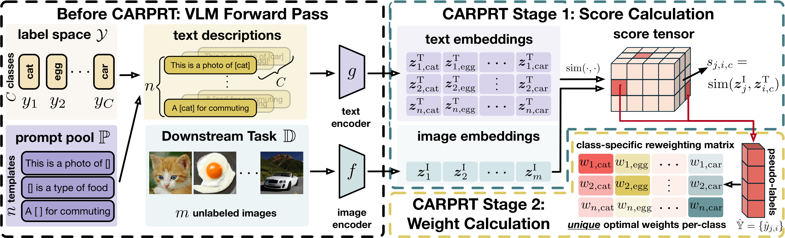

# CARPRT: Class-Aware Zero-Shot Prompt Reweighting for Black-Box Vision-Language Models

> Official implementation of **CARPRT (ICLR 2026)** — a training-free, black-box method for class-aware prompt reweighting in vision-language models.

[](https://openreview.net/pdf?id=AScQDQqVXY)
[](https://www.python.org/downloads/)


---

**CARPRT** improves zero-shot classification in CLIP-like models by estimating **class-aware prompt weights** from unlabeled data.
Unlike prior methods that assign a single weight to each prompt across all classes, CARPRT models **class-dependent prompt relevance**, leading to more accurate predictions in a fully **training-free, black-box** setting.

---



> CARPRT estimates class-specific prompt weights from unlabeled images and improves zero-shot prediction via reweighted prompt ensembling.

---

## Method overview

CARPRT estimates prompt importance separately for each class using only unlabeled test images and similarity scores from a pre-trained vision–language model.

The procedure consists of two stages:

1. **Score collection**  
   Compute image–text similarity for all prompt–class pairs.

2. **Weight estimation and inference**  
   Aggregate class-conditional scores to obtain class-specific prompt weights, then reweight prompts during prediction.

---

## Installation
We recommend a conda environment with **Python 3.8+** and a **CUDA** build of PyTorch (the code calls `.cuda()` for model and tensors).

```bash
# 1) Create and activate environment 
conda create -y -n carprt python=3.8
conda activate carprt
# 2) Clone and enter the repository
git clone <YOUR_REPO_URL>.git
cd carpr
# 3) Install dependencies
pip install -r requirements.txt
```

---

### Data preparation

Place datasets under **`--data-root`** (default in code: `/projects/datasets` — change to your path). Each dataset loader under `datasets/*.py` defines the expected subdirectory name and layout (e.g. Caltech-101 expects `caltech-101/101_ObjectCategories/` and the Zhou split JSON beside it).

**First-time download:** Several builders use **`gdown`** to fetch archives from Google Drive when paths are missing (`datasets/utils.py`).

---

### Evaluation

**Main entry point:** `test.py`

| Argument | Required | Description |
|----------|----------|-------------|
| `--datasets` | Yes | One or more dataset ids, **slash-separated** (e.g. `caltech101/dtd` or `I/A`). |
| `--backbone` | Yes | CLIP backbone: `RN50` or `ViT-B/16`. |
| `--data-root` | No | Root folder for all benchmarks (see default in `test.py`). |
| `--temp` | No | Temperature for softmax over prompt weights (default `1.0`). |
| `--config` | No | Reserved; unused (kept for backward-compatible command lines). |

**Supported dataset ids** (must match `utils.build_test_data_loader`):

| Id | Benchmark |
|----|-----------|
| `I` | ImageNet |
| `A` | ImageNet-A |
| `V` | ImageNet-V2 |
| `R` | ImageNet-R |
| `S` | ImageNet-Sketch |
| `caltech101`, `dtd`, `eurosat`, `fgvc`, `food101`, `oxford_flowers`, `oxford_pets`, `stanford_cars`, `sun397`, `ucf101` | Fine-grained / generic recognition |
| `cifar10`, `imcifar10`, `cifar100`, `imcifar100` | CIFAR variants |

**Minimal example:**

```bash
CUDA_VISIBLE_DEVICES=0 \
python test.py \
  --datasets caltech101 \
  --backbone ViT-B/16 \
  --data-root /path/to/datasets
```

**Batch evaluation** (several sets in one run):

```bash
python test.py \
  --datasets caltech101/dtd/eurosat/food101/oxford_pets \
  --backbone ViT-B/16 \
  --data-root /path/to/datasets \
  --temp 1.0
```

---

### Citation

If you use this code or the CARPRT method, please cite **the CARPRT paper** (replace with the official BibTeX once available).

```bibtex
@article{carprt,
  title   = {CARPRT: Class-Aware Reweighting of Prompt Templates at Test Time},
  author  = {TODO},
  journal = {TODO},
  year    = {TODO}
}
```

---
